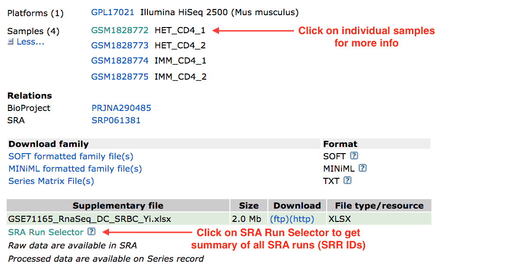
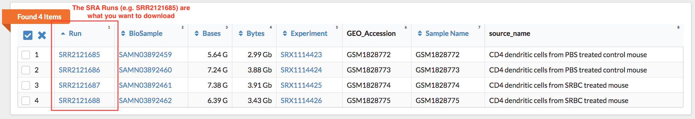
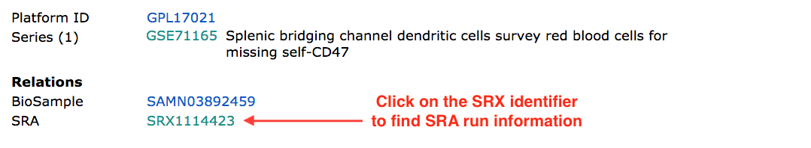
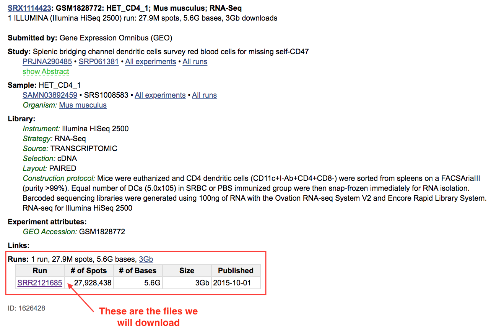

Batch downloading FASTQ files using the SRA toolkit, fastq-dump, and Python
================
Erick Lu
February 10, 2020

-   [Introduction](#introduction)
-   [Finding raw sequencing data in GEO](#finding-raw-sequencing-data-in-geo)
-   [Downloading FASTQ files using the SRA toolkit](#downloading-fastq-files-using-the-sra-toolkit)
-   [Automating downloads using Python](#automating-downloads-using-python)
-   [Running fastq-dump without prefetch is slow](#running-fastq-dump-without-prefetch-is-slow)
-   [Conclusion](#conclusion)

Introduction
------------

Most scientific journals require scientists to make their sequencing data publicly available. This way, other researchers in the world can download the raw data and re-analyze it for their own purposes. Raw RNA-sequencing data is usually deposited in the Gene Expression Omnibus (GEO), at <https://www.ncbi.nlm.nih.gov/geo/>.

How do we access the data? Raw sequencing data comes in huge files that are often multiple gigabytes in size per sample. If you are a researcher with little bioinformatics experience, the finding and downloading the data can be somewhat complicated. This guide explains how to:

1.  Navigate through GEO to find raw sequencing data.
2.  Download and convert SRA files to FASTQ files using the NCBI's SRA toolkit.
3.  Use a Python script to batch download files with the SRA prefetch and fastq-dump tools.

Finding raw sequencing data in GEO
----------------------------------

Let's say you are reading a paper in a journal and see an interesting RNA-seq experiment. You decide that you want to sift through the data for your own genes of interest. The first step is finding the GEO accession number corresponding to the dataset. To find it, you should navigate to the methods section and search (Ctrl-F) for "GSE". An identifier such as GSE<small>XXXXX</small>, where <small>X</small> represents an integer, usually shows up in a statement such as: "the data have been deposited in GEO under accession number GSE<small>XXXXX</small>". If that doesn't work, try to search for "GEO". Once we have the accession number, we can now search GEO to find the dataset.

As an example, let's work with an RNA-seq study that I analyzed for [Li et al. Nature 2019](https://www.ncbi.nlm.nih.gov/pmc/articles/PMC4883664/), which can be found in GEO under accession number GSE71165 (<https://www.ncbi.nlm.nih.gov/geo/query/acc.cgi?acc=GSE71165>). The purpose of this analysis was to explore the genes that splenic dendritic cells upregulated upon stimulation. Following the link, we can see all the details associated with the study. If we scroll to the bottom of the page, we should see a list of samples as well as a link to the **SRA Run Selector**, which I've pointed out in the following image:



If we click on the **SRA Run Selector** link, we will see a table of identifers for each of the samples. What we need are the SRA Run IDs, which start with the prefix "SRR". I've pointed out where to find them in the image below:



The SRA runs (e.g. SRR2121685) correspond to the actual sequencing files that we want to download in order to access the raw data. Sometimes, there will be multiple SRA runs for each sample, and they will be displayed as multiple rows in the table above, sharing a common GSM and SRX number. This means that the lab had deposited multiple FASTQ files for one sample and did not bother to concatenate them together prior to deposition.

You can get more details about how each sample was prepared clicking on the GSM identifier in the **Samples** section from the first image (e.g. GSM1828772). This will take you to the sample description [page](https://www.ncbi.nlm.nih.gov/geo/query/acc.cgi?acc=GSM1828772). Scrolling down to the **Relations** section will show you the sample's SRA identifier, beginning with "SRX":



Clicking on the SRA number (for example, SRX1114423 for HET\_CD4\_1) will bring you to yet another [page](https://www.ncbi.nlm.nih.gov/sra?term=SRX1114423) that provides information about the SRA runs for that sample (e.g. SRR2121685 for HET\_CD4\_1), shown below:



Although it's more work, I prefer clicking through these pages for each individual sample because they provide important information such as how the libraries were prepared. I have summarized the different identifiers for GSE71165 in the following table:

<table style="width:82%;">
<colgroup>
<col width="16%" />
<col width="16%" />
<col width="16%" />
<col width="31%" />
</colgroup>
<thead>
<tr class="header">
<th>Sample Name</th>
<th>GSM Identifier</th>
<th>SRA Identifier (SRX)</th>
<th>SRA Runs (SRR, download these)</th>
</tr>
</thead>
<tbody>
<tr class="odd">
<td>HET_CD4_1</td>
<td>GSM1828772</td>
<td>SRX1114423</td>
<td>SRR2121685</td>
</tr>
<tr class="even">
<td>HET_CD4_2</td>
<td>GSM1828773</td>
<td>SRX1114424</td>
<td>SRR2121686</td>
</tr>
<tr class="odd">
<td>IMM_CD4_1</td>
<td>GSM1828774</td>
<td>SRX1114425</td>
<td>SRR2121687</td>
</tr>
<tr class="even">
<td>IMM_CD4_2</td>
<td>GSM1828775</td>
<td>SRX1114426</td>
<td>SRR2121688</td>
</tr>
</tbody>
</table>

To eventually get the raw data in FASTQ format, we first need to first download the SRA Run files associated with each sample (for example, SRR2121685 for HET\_CD4\_1). Downloading SRR2121685 will result in a file called SRR2121685.sra. But what is a .sra file and what does it do? A SRA file can be used by the NCBI's SRA toolkit as a set of "instructions" to construct the the FASTQ file. The next section explains the SRA toolkit and shows you how to download and convert SRA files into FASTQ files.

Downloading FASTQ files using the SRA toolkit
---------------------------------------------

In order to download the SRA files onto your machine, we use the NCBI's SRA toolkit, which lets us use the command line to download a specified SRA run. If you are using a Linux platform, you can type: `apt install sra-toolkit` in your command line to install the toolkit. You can read more about SRA toolkit here: <https://www.ncbi.nlm.nih.gov/books/NBK242621/> and at their github repo: <https://github.com/ncbi/sra-tools>.

The toolkit works by first using the `prefetch` command to download the SRA file associated with the specified SRA run ID.

For example, to download the SRA file for HET\_CD4\_1 (SRA Run identifier: SRR2121685), the command would be:

``` bash
prefetch SRR2121685 
```

You should observe the following output from running the command:

    2020-02-06T21:54:29 prefetch.2.8.2: 1) Downloading 'SRR2121685'...
    2020-02-06T21:54:29 prefetch.2.8.2:  Downloading via https...
    2020-02-06T21:57:32 prefetch.2.8.2: 1) 'SRR2121685' was downloaded successfully

The file `SRR2121685.sra` should be downloaded into your home directory at ~/ncbi/public/sra/.

``` bash
ls ~/ncbi/public/sra
```

    SRR2121685.sra

After you have downloaded the SRA file, you can use the command `fastq-dump` to extract the contents of it into a `.fastq.gz` file. The Edwards lab at SDSU provides a nice tutorial for how to use fastq-dump here: <https://edwards.sdsu.edu/research/fastq-dump/>, with each of the settings explained. A sample command to extract SRR2121685.sra would be:

``` bash
fastq-dump --outdir fastq --gzip --skip-technical  --readids --read-filter pass --dumpbase --split-3 --clip ~/ncbi/public/sra/SRR2121685.sra
```

If successful, you should see the following output show up in your terminal:

    Read 27928438 spots for /home/ericklu/ncbi/public/sra/SRR2121685.sra
    Written 27928438 spots for /home/ericklu/ncbi/public/sra/SRR2121685.sra

We can check the folder `fastq/` to make sure our files were downloaded correctly:

``` bash
ls fastq
```

    SRR2121685_pass_1.fastq.gz  SRR2121685_pass_2.fastq.gz

We observe that two fastq files have been extracted from SRR2121685.sra. This is because the original data was produced from paired-end sequencing, which usually has both a Read1 file and Read2 file. `fastq-dump` has extracted the SRA file into two files, with suffix "\_1" for paired-end read 1 and "\_2" for paired-end read 2. I typically use the settings provided above for `fastq-dump` as my default settings.

Automating downloads using Python
---------------------------------

Since there are lots of SRA files associated with our samples, it would take a long time to manually run `prefetch` and `fastq-dump` for all the files. To automate this process, I wrote a small script in python to first download each SRA file using `prefetch` and then run `fastq-dump`. The code is shown below and also provided in this repo as `fastq_download.py`:

``` py
import subprocess

# samples correspond to Het_1, Het_2, Imm_1, Imm_2
sra_numbers = [
    "SRR2121685", "SRR2121686", "SRR2121687", "SRR2121688"
    ]

# this will download the .sra files to ~/ncbi/public/sra/ (will create directory if not present)
for sra_id in sra_numbers:
    print ("Currently downloading: " + sra_id)
    prefetch = "prefetch " + sra_id
    print ("The command used was: " + prefetch)
    subprocess.call(prefetch, shell=True)

# this will extract the .sra files from above into a folder named 'fastq'
for sra_id in sra_numbers:
    print ("Generating fastq for: " + sra_id)
    fastq_dump = "fastq-dump --outdir fastq --gzip --skip-technical  --readids --read-filter pass --dumpbase --split-3 --clip ~/ncbi/public/sra/" + sra_id + ".sra"
    print ("The command used was: " + fastq_dump)
    subprocess.call(fastq_dump, shell=True)
```

We can run the python script by simply navigating to the folder on your machine where you want to store the FASTQ files (via the command line), then running `python fastq_download.py`. After running the python script, our FASTQ files should all be sitting in a directory called 'fastq'.

``` bash
ls fastq
```

    SRR2121685_pass_1.fastq.gz  SRR2121686_pass_1.fastq.gz  SRR2121687_pass_1.fastq.gz  SRR2121688_pass_1.fastq.gz
    SRR2121685_pass_2.fastq.gz  SRR2121686_pass_2.fastq.gz  SRR2121687_pass_2.fastq.gz  SRR2121688_pass_2.fastq.gz

If you would like to re-purpose the Python script for you own project, simply replace the SRA run IDs with those that match the files you want to download, by modifying the variable `sra_numbers`.

Running fastq-dump without prefetch is slow
-------------------------------------------

If you don't pre-download the SRA files and just run the `fastq-dump` command, the FASTQ file will still be generated. The SRA toolkit manual at <https://www.ncbi.nlm.nih.gov/books/NBK242621/> says that this is a valid alternative. I would advise against it, since I have found this method to be much slower than first running `prefetch` and then `fastq-dump` on the pre-downloaded SRA files. Here's some proof, in which I time the processes below:

-   Time it takes to download SRR2121685 using `prefetch`:

``` bash
time prefetch SRR2121685
```

    2020-02-07T02:39:54 prefetch.2.8.2: 1) Downloading 'SRR2121685'...
    2020-02-07T02:39:54 prefetch.2.8.2:  Downloading via https...
    2020-02-07T02:43:07 prefetch.2.8.2: 1) 'SRR2121685' was downloaded successfully

    real    3m15.028s
    user    0m51.353s
    sys     0m12.287s

-   Time it takes to `fastq-dump` from the pre-downloaded SRR2121685 file:

``` bash
time fastq-dump --outdir fastq --gzip --skip-technical  --readids --read-filter pass --dumpbase --split-3 --clip ~/ncbi/public/sra/SRR2121685.sra
```

    Read 27928438 spots for /home/ericklu/ncbi/public/sra/SRR2121685.sra
    Written 27928438 spots for /home/ericklu/ncbi/public/sra/SRR2121685.sra

    real    22m21.284s
    user    22m11.772s
    sys     0m4.078s

-   Time it takes to `fastq-dump` without pre-downloading SRR2121685:

``` bash
time fastq-dump --outdir fastq --gzip --skip-technical  --readids --read-filter pass --dumpbase --split-3 --clip SRR2121685
```

    Read 27928438 spots for SRR2121685
    Written 27928438 spots for SRR2121685

    real    77m34.548s
    user    25m37.226s
    sys     0m12.551s

Downloading the SRA file took 3 min 15 seconds, and running `fastq-dump` on the pre-downloaded SRA file of size 3210181560 bytes took 22 min 21 seconds, making the `prefetch` + `fastq-dump` option take a total of 25 min 36 seconds. In comparison, running `fastq-dump` without pre-downloading the files for the same SRA ID took a total time of 77 minutes 34 seconds!

Conclusion
----------

We are done downloading the FASTQ files! Now, we can start mapping the reads to a reference genome and perform downstream bulk RNA-sequencing analysis. If you want to see more, I performed differential gene expression analysis on this data to find genes that were upregulated in the IMM\_CD4\_1 and IMM\_CD4\_2 samples compared to the HET\_CD4\_1 and HET\_CD4\_2 samples, which you can find at: <https://github.com/erilu/dendritic-cell-bulk-rnaseq>. I hope that this short tutorial has helped you learn how to use the SRA tools to download raw sequencing data. Thanks for reading!
